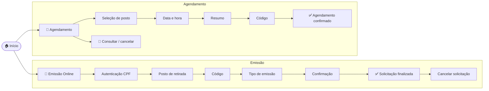

<div align="center">


# 🪪 CidadãoSC — Carteira de Identidade Nacional

#### Emissão Online e Agendamento Presencial da CIN · Santa Catarina

_Réplica fiel e funcional do portal da CIN (Polícia Científica de SC), com foco em **acessibilidade de verdade**._

<br/>


</div>

---

## ✨ Sobre

**CidadãoSC** reproduz o fluxo completo de **Emissão Online** e **Agendamento Presencial** da
Carteira de Identidade Nacional de Santa Catarina — da autenticação por CPF até a guia de
solicitação — em uma SPA leve em **React + Vite**, sem dependências de backend.

O grande diferencial é a **camada de acessibilidade**: barra de preferências (fonte, temas,
contraste, dislexia…), **leitor de tela por foco/hover** e o **widget oficial VLibras** (tradução
para Libras).

> [!NOTE]
> Este é um **protótipo de interface**. Não há servidor real: os passos de validação
> (código, CPF, captcha) são simulados no front-end para demonstrar o fluxo.

---

## 🗺️ Fluxos do sistema



---

## ♿ Acessibilidade e Internacionalização (i18n) — O Coração do Projeto

<table>
<tr>
<td width="25%" valign="top">

### 🎛️ Barra de preferências
- Tamanho da fonte (12–28px)
- 5 temas (claro, escuro, azul, sépia, **alto contraste**)
- Imagens: mostrar / ocultar / cinza
- Altura de linha e espaçamento
- Fonte **OpenDyslexic**
- Mídias externas on/off
- Preferências salvas (localStorage)

</td>
<td width="25%" valign="top">

### 🔊 Leitor de tela
- Lê **apenas** o elemento em foco/hover
- Descrição acessível por componente
- Anuncia papel + nome + estado no idioma ativo
- Acompanha a voz ideal para `pt-BR`, `en-US` ou `es-ES`
- Sem leituras duplicadas
- Acompanha a navegação por teclado

</td>
<td width="25%" valign="top">

### 🌐 Multilíngue (i18n)
- Suporte a **Português**, **Inglês** e **Espanhol**
- Seletor de idioma direto na barra de acessibilidade
- Tradução de todos os textos, placeholders, modais e ARIA labels
- Estado reativo global via React Context API

</td>
<td width="25%" valign="top">

### 🤟 VLibras (Condicional)
- Widget **oficial** do gov.br
- Tradução do conteúdo para **Libras**
- Botão flutuante (canto inferior)
- **Habilitado apenas em Português (pt-BR)**. Fica oculto/desativado ao selecionar Inglês ou Espanhol.

</td>
</tr>
</table>

Conformidade **WCAG**: navegação por teclado, ordem de foco, foco visível, contraste, `alt`
em todas as imagens, rótulos e atributos ARIA, e compatibilidade com leitores de tela em múltiplos idiomas.

---

## 🛠️ Stack

| Camada | Tecnologia |
|---|---|
| **UI** | React 19 |
| **Build / Dev** | Vite 8 |
| **Linguagem** | JavaScript / JSX (ESM) |
| **Estilo** | CSS puro + CSS Variables (temas) |
| **Lint** | ESLint 10 |
| **Internacionalização** | Context API nativa + LocalStorage (`i18n.jsx`) |
| **Acessibilidade** | Web Speech API (Vozes Multilíngues) · VLibras · OpenDyslexic |

---

## 🚀 Começando

```bash
# 1. Instalar dependências
npm install

# 2. Rodar em desenvolvimento  →  http://localhost:5173
npm run dev

# 3. Build de produção
npm run build

# 4. Pré-visualizar o build
npm run preview
```

> 💡 O avatar do **VLibras** depende de internet e renderiza melhor em navegadores comuns
> (Chrome, Edge, Firefox).

---

## 📁 Estrutura do projeto

<details>
<summary><b>Ver árvore de arquivos</b></summary>

```
CidadaoSC/
├─ public/
│  └─ favicon.svg              # ícone (crachá CIN)
├─ src/
│  ├─ App.jsx                  # roteamento por estado + montagem dos widgets
│  ├─ index.css                # design tokens (CSS variables)
│  ├─ components/
│  │  ├─ AccessibilityBar.jsx  # barra de acessibilidade + leitor de tela
│  │  ├─ VLibrasWidget.jsx     # integração oficial VLibras
│  │  ├─ DateModal.jsx         # calendário de agendamento
│  │  ├─ TimeModal.jsx         # horários disponíveis
│  │  ├─ PageHeader.jsx · Stepper.jsx · Footer.jsx
│  │  ├─ InfoBanner.jsx · CaptchaMock.jsx · Icons.jsx
│  └─ pages/
│     ├─ Emissão:    EmissaoCPF · PostoRetirada · AutenticacaoContato/Codigo
│     │              · TipoEmissao · Confirmacao · SolicitacaoFinalizada
│     │              · CancelarEmissao · RecuperarCPF · ResultadoConsulta
│     └─ Agendamento: SelecaoPosto · DataHora · ResumoAgendamento
│                     · AutenticacaoAgendamento · AgendamentoConfirmado
│                     · ConsultarAgendamento · CancelarAgendamento
│                     · SolicitacaoCancelada
└─ index.html
```

</details>

---

## 🧭 Telas

<details>
<summary><b>Emissão Online</b> — pedido, status e cancelamento</summary>

<br/>

Autenticação (CPF) → Posto de retirada → Contato → Código → Tipo de emissão
(reimpressão) → Confirmação → **Solicitação finalizada** (protocolo, status do pagamento,
guias) → Cancelamento (com confirmação e código).

Inclui o fluxo **"Não lembro meu CPF"** (recuperação por nome, nascimento e nome da mãe).

</details>

<details>
<summary><b>Agendamento Presencial</b> — novo, consulta e cancelamento</summary>

<br/>

Seleção de posto (cidade/CEP) → Data e hora (calendário + horários, múltiplos requerentes)
→ Resumo → Código → **Agendamento confirmado** (guia). Inclui **consulta por protocolo**
(com tratamento de erro) e **cancelamento** com validação por código.

</details>

---

## 📜 Aviso

Projeto **educacional / demonstrativo**, sem vínculo oficial com o Governo de Santa Catarina
ou a Polícia Científica. Logotipos e o widget VLibras pertencem aos seus respectivos
detentores e são usados apenas para fidelidade visual.
